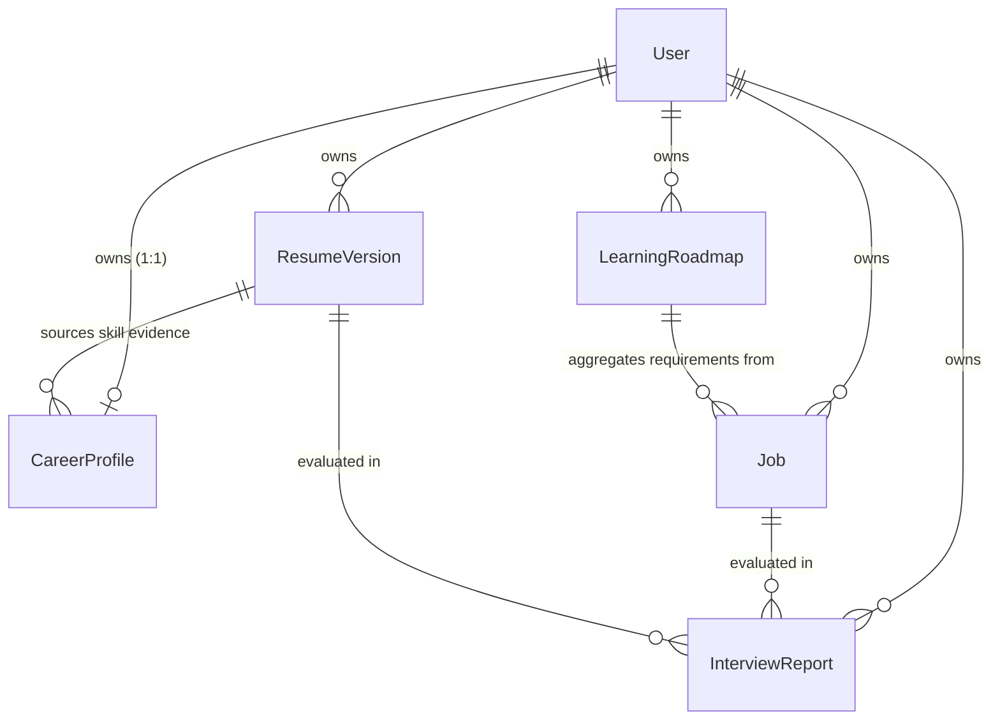

# Rizzume — Phase 3 Final Implementation Report

## 1. Executive Summary

Phase 3 transitions **Rizzume** from an AI-assisted resume evaluation tool into a persistent, deterministic **Career Intelligence Platform**. Prior to this phase, candidates could evaluate resumes against single job descriptions in isolation, but lacked persistent career state, multi-job gap aggregation, verified skill tracking, and personalized curriculum roadmaps.

Phase 3 engineered a complete career intelligence workspace across 6 rigorously audited slices:
1. **Slice 1 — First-Class Career Models & Schema Evolution**: Introduced 1:1 `CareerProfile` and snapshot `LearningRoadmap` models, and evolved the `Job` model into an active recruitment tracker.
2. **Slice 2 — Canonical Skill Normalization & Deterministic Gap Engine**: Built a pure deterministic normalizer mapping all skill variations (e.g. `React.js` $\rightarrow$ `React`) and a mathematical multi-job gap engine ($M_{\text{freq}}$ multiplier, status weights, and grounded provenance rules).
3. **Slice 3 — AI Roadmap Generation & Grounding Integration**: Built an AI curriculum pipeline with an impenetrable boundary—deterministic gap metadata (`canonicalSkill`, `priority`, `gapScore`, `reason`) is strictly immutable and backend-controlled, while Gemini generates only actionable learning content validated via Zod.
4. **Slice 4 — REST API Endpoints & State Management**: Deployed private REST endpoints for Career Profile, Dashboard metrics, Gap Analysis, Job Tracking, and Roadmap lifecycle with strict user ownership and IDOR protection.
5. **Slice 5 — Career Intelligence Workspace Frontend**: Implemented a responsive workspace UI (`/`, `/jobs`, `/gaps`, `/roadmap`, `/interview`) driven 100% by backend APIs without client-side score calculations or mock data.
6. **Slice 6 — Integration, Security, Testing & QA**: Hardened the end-to-end evidence synchronization pipeline (`Resume` $\rightarrow$ `InterviewReport` $\rightarrow$ `CareerProfile` $\rightarrow$ `Gaps` $\rightarrow$ `Roadmap` $\rightarrow$ `Dashboard`), verified IDOR protections across all resources, and validated 100% test pass rates across backend and frontend.

---

## 2. Phase 2 Baseline Invariants Preserved

Phase 3 was developed strictly on top of the verified Phase 2 baseline commit `683561d` (*"feat: complete phase 2 grounded evidence scoring"*).
- **Core Security Preserved**:
  - JWT token blacklisting with 24-hour TTL on logout.
  - Strict IDOR ownership scoping on all documents (`{ user: req.user.id }`).
  - PDF upload validation (5MB max, `%PDF-` magic-byte verification, $\ge 50$ readable characters).
  - Sanitized error envelopes masking internal database and stack traces.
- **Scoring Invariants Preserved**:
  - The Interview Evaluator continues to calculate match scores deterministically via [`Backend/src/services/scoring.service.js`](file:///c:/Users/DELL/OneDrive/Desktop/New%20folder/Rizzume-AiReportAndResumeGenerator/Backend/src/services/scoring.service.js).
  - Verbatim citation grounding via `verifyAndGroundEvidence` remains the single arbiter of grounded vs. ungrounded resume claims.
- **Regression Zero**:
  - All 42 Phase 2 baseline test cases continue to pass without modification.

---

## 3. Architecture & Data Model Evolution

### Data Models & Relationships



### 1. `CareerProfile` ([`Backend/src/models/careerProfile.model.js`](file:///c:/Users/DELL/OneDrive/Desktop/New%20folder/Rizzume-AiReportAndResumeGenerator/Backend/src/models/careerProfile.model.js))
- **Cardinality**: Strictly 1:1 with `User` via unique indexed `user` ObjectId.
- **Target Context**: `targetRole` (max 100 chars), `targetRoles` array, `headline` (max 150 chars), `experienceLevel` (`entry`, `mid`, `senior`, `lead`, `principal` — optional with no default assumption), `preferredDomains` array, and `careerGoals` array.
- **Candidate Skill Inventory**:
  - `canonicalName`: Cleansed, canonical skill identity.
  - `displayName`: Human-readable skill name.
  - `category`: Candidate-oriented ontology (`technology`, `programming_language`, `framework`, `database`, `tool`, `cloud`, `domain`, `soft_skill`, `experience`, `education`, `other`). Excludes job requirement categories like `required_skill` / `preferred_skill`.
  - `status`: Explicit skill status (`demonstrated`, `partial`, `unverified`).
  - `evidence`: Subdocument citations with `verbatimQuote`, `sourceResumeVersion` reference, `isGrounded` boolean, and `verifiedAt` timestamp.

### 2. `Job` ([`Backend/src/models/job.model.js`](file:///c:/Users/DELL/OneDrive/Desktop/New%20folder/Rizzume-AiReportAndResumeGenerator/Backend/src/models/job.model.js))
- **Tracking Lifecycle**: Evolved into a complete recruitment pipeline model.
- **Canonical Status Contract**:
  $$\text{status} \in \{\text{saved}, \text{applied}, \text{interviewing}, \text{offer}, \text{rejected}, \text{archived}\}$$
  *(Strictly eliminates non-canonical statuses such as `offered`).*
- **Pipeline Fields**: `applicationDate`, `notes`, `sourceUrl`, and `targetRole`.
- **Structured Requirements**: Preserves structured requirements (`requirement`, `category`, `importance`, `weight`) extracted by Gemini or supplied manually.

### 3. `LearningRoadmap` ([`Backend/src/models/learningRoadmap.model.js`](file:///c:/Users/DELL/OneDrive/Desktop/New%20folder/Rizzume-AiReportAndResumeGenerator/Backend/src/models/learningRoadmap.model.js))
- **Snapshot Architecture**: Each generation creates an immutable snapshot of skill gaps at a point in time.
- **Lifecycle Statuses**:
  - Roadmap Snapshot: `active | completed | archived`
  - Roadmap Item: `not_started | in_progress | completed | skipped`
- **Strict Separation of Concerns**:
  - **Deterministic Fields (Backend-Controlled)**: `canonicalSkill`, `displayName`, `category`, `priority`, `gapStatus`, `gapScore`, `jobFrequency`, `reason`.
  - **AI-Enriched Learning Fields**: `targetOutcome`, `learningObjectives` (array of strings), `practiceIdeas` (array of strings), `estimatedHours`.
  - **Progress Tracking Fields**: `status`, `completedAt`.

---

## 4. Canonical Skill Normalization Engine

Implemented in [`Backend/src/services/skillNormalizer.js`](file:///c:/Users/DELL/OneDrive/Desktop/New%20folder/Rizzume-AiReportAndResumeGenerator/Backend/src/services/skillNormalizer.js).

### Principles & Implementation
- **Zero AI / Zero Hallucinations**: Pure deterministic lookup dictionary with regex-based text cleansing.
- **String Cleansing Algorithm**:
  1. Lowercase and trim.
  2. Strip non-semantic punctuation (trailing periods, hyphens, brackets, version noise).
  3. Look up in canonical dictionary. If mapped, return standard canonical name; otherwise, capitalize intelligently.
- **Canonical Mappings Verified**:
  - `React`, `ReactJS`, `React.js`, `React 18`, `React v19` $\rightarrow$ `React`
  - `Node`, `NodeJS`, `Node.js`, `Node JS` $\rightarrow$ `Node.js`
  - `Postgres`, `PostgreSQL`, `PSQL` $\rightarrow$ `PostgreSQL`
  - `Mongo`, `MongoDB` $\rightarrow$ `MongoDB`
  - `TS`, `TypeScript`, `type script` $\rightarrow$ `TypeScript`
  - `JS`, `JavaScript`, `es6`, `ecmascript` $\rightarrow$ `JavaScript`
  - `Docker`, `containerization`, `docker compose` $\rightarrow$ `Docker`
  - `K8s`, `Kubernetes` $\rightarrow$ `Kubernetes`
  - `AWS`, `Amazon Web Services` $\rightarrow$ `AWS`
- **Metadata Registry**: Provides candidate skill category (`framework`, `database`, `tool`, etc.) and related skill associations.

---

## 5. Deterministic Gap Engine

Implemented in [`Backend/src/services/gap.service.js`](file:///c:/Users/DELL/OneDrive/Desktop/New%20folder/Rizzume-AiReportAndResumeGenerator/Backend/src/services/gap.service.js).

### Mathematical Model

$$\text{GapScore} = W_{\text{importance}} \times F_{\text{gap}} \times M_{\text{freq}}$$

Where:
1. **Importance Weight ($W_{\text{importance}}$)**:
   - `critical`: $4$
   - `high`: $3$
   - `medium`: $2$
   - `low`: $1$
2. **Gap Factor ($F_{\text{gap}}$)**:
   - `missing`: $1.0$ (Candidate has no verified coverage)
   - `partial`: $0.5$ (Candidate has partial verified coverage)
   - `matched`: $0.0$ (Candidate has demonstrated verified coverage)
3. **Frequency Multiplier ($M_{\text{freq}}$)**:
   $$M_{\text{freq}} = 1 + \min(1.0, 0.25 \times (\text{frequency} - 1))$$
   - 1 target job: $1.00\times$
   - 2 target jobs: $1.25\times$
   - 3 target jobs: $1.50\times$
   - 4 target jobs: $1.75\times$
   - 5+ target jobs: $2.00\times$ (Deterministic cap)

### Candidate Status Evaluation Rule
A candidate skill claim is evaluated against grounded evidence:
- `demonstrated` $+$ $\ge 1$ grounded evidence citation $\rightarrow$ `demonstrated`
- `partial` $+$ $\ge 1$ grounded evidence citation $\rightarrow$ `partial`
- `unverified` OR all citations ungrounded (`isGrounded === false`) $\rightarrow$ `missing`
- Absent from candidate profile $\rightarrow$ `missing`

### Priority Bands & Deterministic Sorting
- **Priority Bands**:
  - `critical`: $\text{GapScore} \ge 4.0$ OR ($\text{Importance} = \text{critical}$ AND $F_{\text{gap}} > 0$)
  - `high`: $2.5 \le \text{GapScore} < 4.0$
  - `medium`: $1.0 \le \text{GapScore} < 2.5$
  - `low`: $0 < \text{GapScore} < 1.0$
  - `matched`: $\text{GapScore} = 0.0$
- **Deterministic Sort Hierarchy**:
  1. Priority order (`critical` > `high` > `medium` > `low`)
  2. $\text{GapScore}$ descending
  3. Job frequency descending
  4. Canonical skill alphabetical ascending

---

## 6. AI Curriculum & Learning Roadmap Pipeline

Implemented in [`Backend/src/services/roadmap.service.js`](file:///c:/Users/DELL/OneDrive/Desktop/New%20folder/Rizzume-AiReportAndResumeGenerator/Backend/src/services/roadmap.service.js) and [`Backend/src/services/ai.service.js`](file:///c:/Users/DELL/OneDrive/Desktop/New%20folder/Rizzume-AiReportAndResumeGenerator/Backend/src/services/ai.service.js).

### The AI / Deterministic Boundary
```text
┌─────────────────────────────────────────────────────────────┐
│                 Deterministic Gap Engine                    │
│  - Decides which skills are missing / partial               │
│  - Calculates exact gapScores, jobFrequency & priority      │
│  - Writes deterministic audit reason                        │
└──────────────────────────────┬──────────────────────────────┘
                               │ Prioritized Gaps
                               ▼
┌─────────────────────────────────────────────────────────────┐
│                 Gemini AI Learning Generator                │
│  - Generates ONLY: targetOutcome, learningObjectives,       │
│    practiceIdeas, estimatedHours                            │
│  - CANNOT modify canonicalSkill, gapScore, or priority      │
└──────────────────────────────┬──────────────────────────────┘
                               │ Raw AI JSON
                               ▼
┌─────────────────────────────────────────────────────────────┐
│                    Zod Runtime Validation                   │
│  - Validates array bounds, string lengths, structure        │
│  - Fallback: deterministic offline curriculum if AI fails   │
│  - Strips/ignores any hallucinated canonicalSkill keys      │
└──────────────────────────────┬──────────────────────────────┘
                               │ Validated Items
                               ▼
┌─────────────────────────────────────────────────────────────┐
│              LearningRoadmap Snapshot Persisted             │
└─────────────────────────────────────────────────────────────┘
```

- **Runtime Zod Validation (`roadmapGenerationSchema`)**:
  - Ensures `learningObjectives` has 2–3 concrete points.
  - Ensures `practiceIdeas` has 2–3 interview-focused tasks.
  - Validates `estimatedHours` as an integer between 1 and 100.
- **Fail-Safe Deterministic Fallback**:
  - If Gemini encounters API timeouts, quota limits, or returns invalid JSON, the service synthesizes clean, actionable learning objectives and practice ideas deterministically from the canonical metadata, ensuring roadmap creation never fails.

---

## 7. Grounded Evidence Synchronization

Implemented in [`Backend/src/services/evidenceSync.service.js`](file:///c:/Users/DELL/OneDrive/Desktop/New%20folder/Rizzume-AiReportAndResumeGenerator/Backend/src/services/evidenceSync.service.js).

### End-to-End Flow
Whenever an Interview Evaluation Report is created in [`Backend/src/controllers/interview.controller.js`](file:///c:/Users/DELL/OneDrive/Desktop/New%20folder/Rizzume-AiReportAndResumeGenerator/Backend/src/controllers/interview.controller.js):
1. Evaluator computes `verifiedMatches` with verbatim text quotes from candidate text.
2. For each match that is `matched` or `partial` with `isGrounded: true`:
   - Normalizes the skill via `normalizeSkill`.
   - Non-destructively upserts the skill into `CareerProfile.skills`.
   - Upgrades candidate skill status (`unverified` $\rightarrow$ `partial` $\rightarrow$ `demonstrated`).
   - Appends grounded evidence quotation referencing the source `ResumeVersion`.
3. Requirements with `status: "missing"` are strictly excluded from candidate skills—they remain tracked gaps.
4. Non-blocking error isolation ensures report generation is never compromised by profile sync errors.

---

## 8. REST API Layer & Security Audit

### Endpoints Implemented

| Endpoint | Method | Access | Description |
| :--- | :---: | :---: | :--- |
| `/api/career/profile` | `GET` | Private | Retrieve 1:1 user profile (returns clean default if uninitialized) |
| `/api/career/profile` | `PUT` | Private | Update profile fields (targetRole, headline, experienceLevel, goals) |
| `/api/career/dashboard` | `GET` | Private | Consolidated deterministic intelligence metrics |
| `/api/career/gaps` | `GET` | Private | Run deterministic gap analysis across tracked jobs |
| `/api/jobs` | `POST` | Private | Create reusable target job with structured requirements |
| `/api/jobs` | `GET` | Private | List authenticated user's tracked jobs |
| `/api/jobs/:id` | `GET` | Private | Get single tracked job (ownership verified) |
| `/api/jobs/:id` | `PATCH` | Private | Update job tracking status, notes, or application date |
| `/api/jobs/:id` | `DELETE` | Private | Delete tracked job (ownership verified) |
| `/api/roadmaps` | `POST` | Private | Generate and persist new LearningRoadmap snapshot |
| `/api/roadmaps` | `GET` | Private | List user's roadmap snapshots |
| `/api/roadmaps/:id` | `GET` | Private | Get specific roadmap snapshot (ownership verified) |
| `/api/roadmaps/:id/items/:itemId` | `PATCH` | Private | Update milestone status (`not_started`, `in_progress`, `completed`, `skipped`) |

### Security & IDOR Protections Verified
- **Strict User Scoping**: Every query filters by `{ user: req.user.id }`.
- **Ownership Verification**: Access to jobs, roadmaps, resume versions, or interview reports belonging to another user returns `404 Not Found` (preventing IDOR and information leakage).
- **Malformed ObjectIds**: Handled gracefully with standard 404 error envelopes.
- **Deterministic Field Tampering Protection**: `PATCH /api/roadmaps/:id/items/:itemId` strictly blocks modification of `canonicalSkill`, `displayName`, `category`, `priority`, `gapStatus`, `gapScore`, `jobFrequency`, and `reason` with HTTP 400.
- **Job Status Enforcement**: Validates against canonical enum; rejects legacy `offered` status with HTTP 400.

---

## 9. Career Intelligence Workspace Frontend

### Product Reorientation
Rizzume is now a comprehensive Career Command Center structured into five core views:

1. **Dashboard (`/`) — Career Command Center**:
   - Primary metric cards: Tracked Jobs, Active Pipeline (`applied` + `interviewing`), Demonstrated Skills (grounded evidence count), and Critical Gaps.
   - Deterministic Match Performance: Shows average score across evaluated jobs with clear job count denominator; cleanly renders an empty state prompt when no jobs have been evaluated (never displays fabricated `0%`).
   - Active Roadmap Progress: Displays snapshot completion percentage and active milestone summary.
2. **Job Tracker (`/jobs`) — Pipeline Board**:
   - Canonical status filtering (`saved`, `applied`, `interviewing`, `offer`, `rejected`, `archived`).
   - Add Job modal with instant ATS requirement extraction.
   - Inline notes editor and direct link to evaluate resume against the job.
3. **Gap Analysis (`/gaps`) — Competency Analysis**:
   - Displays deterministic priority bands (`critical`, `high`, `medium`, `low`).
   - Shows job frequency counts and mathematical reasoning for each gap.
   - Lists verified matched skills with citation provenance.
4. **Learning Roadmap (`/roadmap`) — Actionable Milestones**:
   - Generates roadmaps from deterministic gaps with AI learning objectives and practice ideas.
   - Milestone progress tracker supporting `not_started`, `in_progress`, `completed`, `skipped` with optimistic UI updates.
5. **Interview Evaluator (`/interview`, `/interview/:id`)**:
   - Preserves complete Phase 2 resume evaluation, grounded evidence display, technical/behavioral interview preparation, and PDF generation.

---

## 10. Comprehensive Verification Matrix

### Automated Test Suites

```text
Backend Test Suites:
  ✔ Phase 1 & 2 Core Auth, Security & Upload Suites (42 tests)
  ✔ Slice 1 Model Validation Suite (11 tests)
  ✔ Slice 2 Canonical Skill Normalizer Suite (14 tests)
  ✔ Slice 2 Deterministic Gap Engine Suite (9 tests)
  ✔ Slice 3 Roadmap Service & Zod Validation Suite (15 tests)
  ✔ Slice 4 REST APIs & State Management Suite (26 tests)
  ✔ Slice 6 Full Integration & Security IDOR Suite (11 tests)
  Total Backend: 128 / 128 passing (35 test suites, 0 failures)

Frontend Test Suites:
  ✔ Route Architecture & Protected Route Suite (2 tests)
  ✔ Canonical Job Status Contract Suite (2 tests)
  ✔ Dashboard Null Match Score Logic Suite (2 tests)
  ✔ Gap Analysis Priority & Insufficient Data Suite (2 tests)
  ✔ Learning Roadmap Lifecycle & Immutability Suite (3 tests)
  ✔ API Service Architecture Suite (3 tests)
  Total Frontend: 14 / 14 passing (7 test suites, 0 failures)

Frontend Production Build:
  ✔ Vite production build: 100 modules transformed, exit code 0 (built in 1.29s)

Code Quality & Cleanliness:
  ✔ git diff --check: exit code 0 (clean, no whitespace or formatting errors)
  ✔ Working tree: clean, synchronized with origin/main
```

---

## 11. Git Checkpoint Verification

- **Commit**: `701a346a32f86cdb9ce54b2df616ace342a58d93`
- **Subject**: `feat: complete phase 3 career intelligence platform`
- **Branch**: `main`
- **Remote**: `origin/main` (`https://github.com/sanskarchourasiya445/Rizzume-AiReportAndResumeGenerator.git`)
- **Status**: Committed, pushed, and verified clean.
