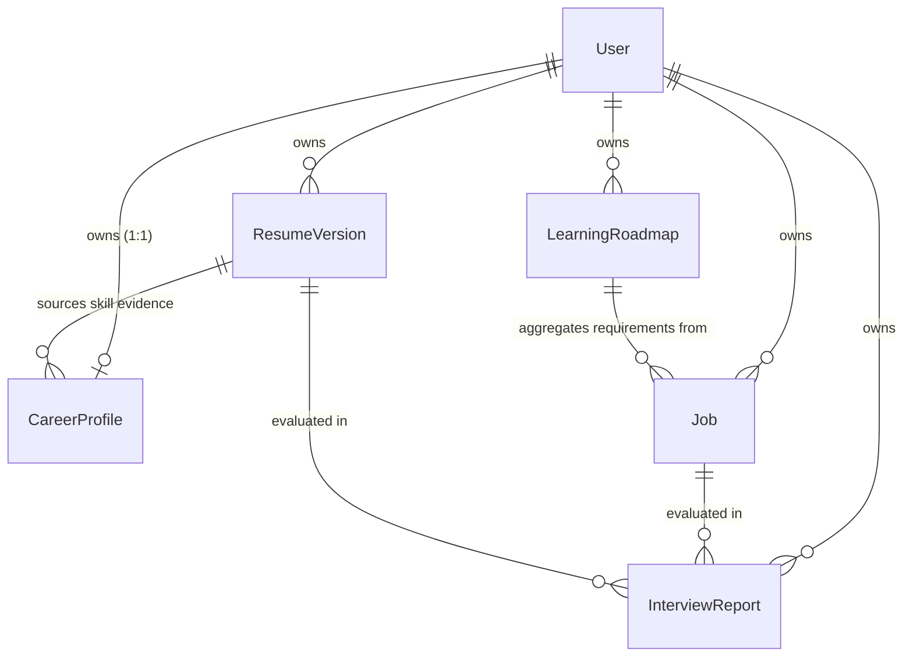

# Rizzume

**AI Career Intelligence Platform**

An evidence-based career intelligence platform that connects resumes, target jobs, deterministic skill gaps, learning roadmaps, and interview evaluation into a unified candidate workspace.

---

## Overview

Most career platforms treat resume generation, job tracking, and interview preparation as disjointed, single-pass generative AI prompts. This leads to hallucinated match scores, ungrounded resume claims, and disconnected advice.

**Rizzume** is built around a closed-loop **evidence-based career intelligence architecture**. Candidate claims are grounded against verified resume text citations, target job requirements are analyzed through deterministic mathematical scoring, skill gaps are aggregated across multiple roles, and AI is strictly constrained to educational curriculum synthesis with validated schemas.

```text
Resume PDF / Text
       ↓
Deterministic Evidence Extraction & Grounding
       ↓
Target Job Requirement Aggregation
       ↓
Deterministic Multi-Job Gap Engine (O(S × J))
       ↓
Bounded AI Learning Roadmap (Gemini 2.5 Flash + Zod)
       ↓
Active Job Pipeline Tracking (Saved → Applied → Interviewing → Offer)
       ↓
Point-in-Time Interview Evaluation & Sandboxed PDF Generation
       ↓
Unified Career Intelligence Dashboard
```

---

## Key Features

| Capability | What It Does | Implementation Invariant |
| :--- | :--- | :--- |
| **Resume Intelligence** | Validates, extracts, and indexes candidate resume versions. | Magic-byte (`%PDF-`) verification, 5MB file ceiling, $\ge 50$ non-whitespace character threshold. |
| **Evidence Grounding** | Ingests candidate skills into a unified 1:1 `CareerProfile`. | Verbatim text quote citations; ungrounded claims are classified as `unverified` and excluded from matched skills. |
| **Target Job Tracker** | Tracks candidate job applications with structured requirements. | Canonical 6-stage lifecycle: `saved \| applied \| interviewing \| offer \| rejected \| archived`. |
| **Deterministic Gap Engine** | Aggregates skill gaps across all active target roles. | Pure mathematical scoring formula factoring role importance, candidate coverage, and frequency multiplier. |
| **Learning Roadmap** | Generates point-in-time milestone snapshots to close skill gaps. | Bounded AI generation: gap metadata and priorities are immutable; Gemini synthesizes only learning objectives and practice ideas. |
| **Interview Intelligence** | Generates technical & behavioral questions with rubrics. | Point-in-time interview evaluation report with sandboxed Puppeteer PDF export (SSRF-protected). |
| **Career Dashboard** | Unified command center for candidate readiness KPIs. | Zero mock data; safely handles null readiness scores when zero jobs have been evaluated. |

---

## Architecture

```text
┌────────────────────────────────────────────────────────────────────────┐
│                        React 19 Frontend (Vite)                        │
│   Dynamic Route Splitting (React.lazy) · Accessible Modals (WAI-ARIA)  │
│   Unified Axios Client (apiClient.js) · Centralized 401 Interceptor    │
└───────────────────────────────────┬────────────────────────────────────┘
                                    │ HTTPS / HTTP-Only Cookies
                                    ▼
┌────────────────────────────────────────────────────────────────────────┐
│                        Express 5 Backend API                           │
│   Auth Middleware (JWT + TTL Blacklist) · User-Scoped Queries (IDOR)   │
│   Credentialed CORS Allowlist · Delimiter Prompt Injection Defense     │
└─────────┬─────────────────────────┬──────────────────────────┬─────────┘
          │                         │                          │
          ▼                         ▼                          ▼
┌──────────────────┐      ┌──────────────────┐       ┌──────────────────┐
│     MongoDB      │      │  Google Gemini   │       │    Puppeteer     │
│  Mongoose 9.4    │      │  2.5 Flash API   │       │  Headless PDF    │
│  User Profiles,  │      │  Structured      │       │  SSRF-Protected, │
│  Jobs, Roadmaps  │      │  Extraction Only │       │  Sandboxed HTML  │
└──────────────────┘      └──────────────────┘       └──────────────────┘
```

---

## Deterministic Gap Scoring Engine

A core architectural principle of Rizzume is that **AI does not score candidate match readiness or calculate skill gaps**. All gap scores are derived deterministically using an $O(S \times J)$ mathematical engine implemented in [`Backend/src/services/gap.service.js`](Backend/src/services/gap.service.js):

$$\text{GapScore}(s) = \max_{j}(W_{\text{importance}}(s, j)) \times F_{\text{gap}}(s) \times M_{\text{freq}}(s)$$

### 1. Importance Weight ($W_{\text{importance}}$)
Reflects the maximum requirement priority across all target jobs demanding skill $s$:
- `critical`: $4$
- `high`: $3$
- `medium`: $2$
- `low`: $1$

### 2. Gap Factor ($F_{\text{gap}}$)
Evaluated against grounded candidate evidence citations in `CareerProfile`:
- `missing`: $1.0$ (Candidate has no verified coverage)
- `partial`: $0.5$ (Candidate has partial verified coverage)
- `matched`: $0.0$ (Candidate has demonstrated verified coverage)

### 3. Frequency Multiplier ($M_{\text{freq}}$)
Scales linearly with recurring demand across multiple target jobs, capped at $2.00\times$:
$$M_{\text{freq}} = 1 + \min(1.0, 0.25 \times (\text{frequency} - 1))$$

| Target Jobs Requiring Skill | Frequency Multiplier ($M_{\text{freq}}$) |
| :---: | :---: |
| 1 job | $1.00\times$ |
| 2 jobs | $1.25\times$ |
| 3 jobs | $1.50\times$ |
| 4 jobs | $1.75\times$ |
| 5+ jobs | $2.00\times$ |

### Deterministic Invariants
- **Zero Gap for Matched Skills**: When $F_{\text{gap}} = 0.0$, $\text{GapScore} = 0.0$ regardless of frequency. Matched skills never clutter the learning backlog, while candidate citations are preserved for provenance.
- **Priority Categorization**:
  - `critical`: $\text{GapScore} \ge 4.0$ OR ($\text{Importance} = \text{critical}$ AND $F_{\text{gap}} > 0$)
  - `high`: $2.5 \le \text{GapScore} < 4.0$
  - `medium`: $1.0 \le \text{GapScore} < 2.5$
  - `low`: $0.0 < \text{GapScore} < 1.0$
  - `matched`: $\text{GapScore} = 0.0$
- **Deterministic Sort**: Items are sorted by priority (`critical` > `high` > `medium` > `low`), descending gap score, descending job frequency, and ascending alphabetical canonical name.

---

## AI Boundary & Safety Model

Google Gemini (`@google/genai`) is strictly constrained to prevent prompt injection and hallucinated evaluations:

```text
Deterministic Inputs (Skill, Category, Priority, GapScore)
                     ↓
Explicit Delimiter Isolation (---BEGIN/END RESUME TEXT---)
                     ↓
Gemini 2.5 Flash Generation
                     ↓
Safe JSON Parse (Throws 502 AppError on Malformed Response)
                     ↓
Zod Schema Validation (resumePdfSchema.safeParse)
                     ↓
Accepted Output Bound to Deterministic Record
```

1. **Prompt Injection Delimiters**: Untrusted candidate input (resume text, self-descriptions) is wrapped in strict boundary delimiters (`---BEGIN RESUME TEXT---` and `---END RESUME TEXT---`) with instructions instructing the model to treat the content solely as data.
2. **Pedagogical Boundary**: During roadmap generation, the AI is **prohibited** from altering skill names, priorities, gap status, or reasons. It is only permitted to synthesize:
   - `targetOutcome` (string)
   - `learningObjectives` (array of strings)
   - `practiceIdeas` (array of strings)
   - `estimatedHours` (number)
3. **Parse Resilience**: AI responses pass through resilient `try/catch` JSON parsing. If the LLM generates truncated or invalid JSON, a clean 502 `AppError` is thrown, preventing server crashes and raw output leakage.

---

## Security & Defense in Depth

- **Authentication & Blacklisting**: JWT tokens signed with HMAC-SHA256, transmitted via `httpOnly`, `SameSite: strict` cookies. Tokens are invalidated upon logout with a MongoDB TTL-indexed blacklist (24-hour expiration).
- **Broken Object-Level Authorization (IDOR) Protection**: All database queries are scoped to the authenticated session (`{ user: req.user.id }`). Attempting to read, mutate, or delete another user's job, resume, roadmap, or interview report returns a clean 404.
- **Production Credentialed CORS**: Configured via `FRONTEND_URL` and `ALLOWED_ORIGINS`. Disallows wildcards (`*`) when credentials are enabled and strictly rejects `localhost` / `127.0.0.1` origins in production (`NODE_ENV === "production"`).
- **Document Upload Validation**: 5MB ceiling, MIME-type verification, `%PDF-` magic-byte checking, and extraction validation ensuring $\ge 50$ readable characters to reject blank or scanned documents.
- **Puppeteer Sandboxing & SSRF Mitigation**: PDF generation runs with full request interception (aborting all external `http`, `https`, and local `file` requests), disabled script execution, and sanitized HTML.
- **Information Disclosure Prevention**: Express 5 error handling middleware intercepts all exceptions, sanitizes database errors, and returns consistent `{ success: false, message }` envelopes without stack traces.

---

## Performance & Bundle Optimization

Implemented in Phase 4 via route-level code splitting using `React.lazy()` and `<Suspense>` wrapped around all 8 application pages:

| Metric | Before Optimization | After Route-Level Splitting | Improvement |
| :--- | :---: | :---: | :---: |
| **Initial JavaScript Bundle** | 413.50 kB | 325.07 kB | **-21.4%** |
| **Initial Gzip Transfer** | 122.87 kB | 106.48 kB | **-13.3%** |
| **Initial CSS Bundle** | 49.69 kB | 0.95 kB | **-98.1%** |
| **Vite Production Build Time** | ~1.2s | **699ms** | **~41% faster** |

Each major route (`Dashboard`, `GapAnalysis`, `JobTracker`, `LearningRoadmap`, `Home`, `Interview`, `Login`, `Register`) is partitioned into an on-demand JavaScript chunk, loaded alongside an accessible `<RouteFallback />` component with `role="status"` and `aria-live="polite"`.

---

## Domain Model & Canonical Lifecycle Contracts



### 1. `Job.status` (Canonical Recruitment Pipeline)
```text
saved → applied → interviewing → offer → rejected | archived
```
*(Strictly eliminates non-canonical statuses like `offered` or `pending`.)*

### 2. `LearningRoadmap.status` (Snapshot Lifecycle)
```text
active → completed | archived
```

### 3. `RoadmapItem.status` (Milestone Execution)
```text
not_started → in_progress → completed | skipped
```

### 4. `CareerProfile.skills[].status` (Grounded Claim Status)
```text
demonstrated | partial | unverified
```

---

## Application Routes

| Route | Access | Component | Purpose |
| :--- | :---: | :--- | :--- |
| `/` | Public | `Home.jsx` | Landing hero, quick evaluator entry, platform value overview. |
| `/login` | Public | `Login.jsx` | Email/password authentication, sets HTTP-only cookie. |
| `/register` | Public | `Register.jsx` | User registration and initial credential creation. |
| `/dashboard` | Protected | `Dashboard.jsx` | Career readiness KPI summary, quick actions, active job cards. |
| `/jobs` | Protected | `JobTracker.jsx` | Recruitment pipeline board with status transitions & modal editor. |
| `/gaps` | Protected | `GapAnalysis.jsx` | Deterministic skill gap aggregation, priority filters, evidence viewer. |
| `/roadmap` | Protected | `LearningRoadmap.jsx` | Snapshot milestone tracker, progress status mutator, learning details. |
| `/interview` | Protected | `Interview.jsx` | Point-in-time interview evaluation report generator and history viewer. |
| `/interview/:interviewId` | Protected | `Interview.jsx` | Historical interview report detail view with PDF download. |

---

## API Reference

### Authentication
- `POST /api/auth/register` — Register a new account (`name`, `email`, `password`).
- `POST /api/auth/login` — Authenticate and receive HTTP-only JWT cookie.
- `POST /api/auth/logout` — Revoke active token into MongoDB blacklist.
- `GET /api/auth/get-me` — Retrieve active authenticated user profile.

### Career Profile & Dashboard
- `GET /api/career/profile` — Fetch 1:1 candidate career profile with skill inventory and citations.
- `PUT /api/career/profile` — Update candidate target role, experience level, domains, or goals.
- `GET /api/career/dashboard` — Fetch aggregated readiness score, evaluated job count, active jobs, and top gaps.

### Skill Gap Analysis
- `GET /api/career/gaps` — Calculate and return deterministic skill gaps aggregated across all target jobs.

### Target Jobs Pipeline
- `POST /api/jobs` — Create a new target job (`title`, `company`, `description`, `status`).
- `GET /api/jobs` — List all target jobs owned by the user (supports `?status=` and pagination).
- `GET /api/jobs/:id` — Get single job details with structured requirements.
- `PATCH /api/jobs/:id` — Update job status, application date, notes, or requirements.
- `DELETE /api/jobs/:id` — Delete target job record.

### Learning Roadmaps
- `POST /api/roadmaps` — Generate a new snapshot roadmap based on current deterministic skill gaps.
- `GET /api/roadmaps` — List all historical roadmaps for the user.
- `GET /api/roadmaps/:id` — Get single roadmap snapshot with milestone items.
- `PATCH /api/roadmaps/:id/items/:itemId` — Update milestone progress status (`not_started`, `in_progress`, `completed`, `skipped`). Rejects tampering with deterministic fields.

### Interview & Resume Evaluation
- `POST /api/interview/` — Upload resume PDF and job description to generate an interview evaluation report.
- `GET /api/interview/` — List historical interview evaluation reports.
- `GET /api/interview/:interviewId` — Retrieve single interview report.
- `POST /api/interview/generate-resume-pdf` — Render sandboxed, tailored PDF resume via Puppeteer.

---

## Tech Stack

### Frontend
- **Framework**: React 19 (`react` 19.2.4, `react-dom` 19.2.4)
- **Build Tool**: Vite 8 (`vite` 8.0.3) with `@vitejs/plugin-react`
- **Routing**: React Router 7 (`react-router` 7.14.0)
- **HTTP Client**: Axios 1.14.0 with centralized 401 interceptor
- **Styling**: SCSS (`sass` 1.99.0) with modular stylesheets
- **Accessibility**: WAI-ARIA dialog attributes, keyboard focus trapping, `RouteFallback` live region

### Backend
- **Runtime**: Node.js (LTS >= 18)
- **Framework**: Express 5 (`express` 5.2.1)
- **Database**: MongoDB with Mongoose (`mongoose` 9.4.1)
- **Validation**: Zod (`zod` 4.3.6) and `zod-to-json-schema`
- **Security**: `bcryptjs` 3.0.3, `jsonwebtoken` 9.0.3, `cookie-parser` 1.4.7, `cors` 2.8.6
- **Document Processing**: `pdf-parse` 2.4.5, `multer` 2.1.1, `puppeteer` 24.40.0
- **AI Integration**: Google GenAI SDK (`@google/genai` 1.48.0)

### Testing Harness
- **Test Runner**: Node.js native test runner (`node:test`, `node --test`)
- **API Assertions**: Supertest 7.3.0
- **In-Memory Database**: MongoDB Memory Server (`mongodb-memory-server` 11.3.0)

---

## Project Structure

```text
Rizzume-AiReportAndResumeGenerator/
├── Backend/
│   ├── index.js                      # Application server entrypoint
│   ├── src/
│   │   ├── app.js                    # Express app configuration & hardened CORS
│   │   ├── config/                   # Database connection & environment setup
│   │   ├── controllers/              # Route controllers (auth, career, job, roadmap, interview)
│   │   ├── middlewares/              # Auth, file upload validation, error middleware
│   │   ├── models/                   # Mongoose models (User, CareerProfile, Job, Roadmap, etc.)
│   │   ├── routes/                   # Express routes
│   │   └── services/                 # Gap engine, normalizer, scoring, AI service
│   ├── tests/                        # 15 backend test suites (147 tests)
│   ├── package.json
│   └── .env.example                  # Backend environment template
│
├── Frontend/
│   ├── src/
│   │   ├── App.jsx                   # Root application with top-level AuthProvider & Suspense
│   │   ├── app.routes.jsx            # Dynamic React.lazy route definitions
│   │   ├── components/               # Accessible UI components (ProfileModal, RouteFallback, WorkspaceNav)
│   │   ├── features/                 # Feature-based domain architecture (auth, career, interview)
│   │   ├── services/                 # Canonical apiClient.js with interceptors
│   │   └── main.jsx                  # React DOM mount point
│   ├── tests/                        # 4 frontend test suites (43 tests)
│   ├── package.json
│   └── vite.config.js
│
├── docs/
│   └── audit/                        # Archival engineering reports & verification index
│       ├── README.md                 # Engineering audit index
│       ├── phase-0-audit-report.md   # Initial repository baseline audit
│       ├── phase-1-report.md         # Foundation & security hardening report
│       ├── phase-2-report.md         # Grounded evidence scoring report
│       ├── phase-3-report.md         # Career intelligence platform report
│       └── phase-4-report.md         # Production hardening & release QA report
│
├── .gitignore
└── README.md                         # This file
```

---

## Local Development Setup

### Prerequisites
- **Node.js**: v18.0.0 or higher
- **MongoDB**: Local MongoDB instance running on `mongodb://127.0.0.1:27017` (or MongoDB Atlas URI)
- **Google Gemini API Key**: From [Google AI Studio](https://aistudio.google.com/)

### 1. Clone the Repository
```bash
git clone https://github.com/sanskarchourasiya445/Rizzume-AiReportAndResumeGenerator.git
cd Rizzume-AiReportAndResumeGenerator
```

### 2. Configure Backend
```bash
cd Backend
npm install
cp .env.example .env
```
Edit `Backend/.env` to configure your settings:
```ini
PORT=3000
MONGO_URI=mongodb://127.0.0.1:27017/rizzume_ai
JWT_SECRET=your_jwt_secret_key_here
GOOGLE_GENAI_API_KEY=your_google_gemini_api_key_here
NODE_ENV=development
FRONTEND_URL=http://localhost:5173
ALLOWED_ORIGINS=http://localhost:5173,http://localhost:3000
```

### 3. Configure Frontend
```bash
cd ../Frontend
npm install
```

### 4. Run the Application
Start the backend server:
```bash
cd Backend
npm run dev     # Starts Express on http://localhost:3000
```

In a separate terminal, start the frontend client:
```bash
cd Frontend
npm run dev     # Starts Vite on http://localhost:5173
```

Open [http://localhost:5173](http://localhost:5173) in your browser.

---

## Testing & Verification

Both tiers feature comprehensive automated test suites using the native Node.js test runner (`node:test`):

```bash
# Run all Backend test suites (in-memory MongoDB)
cd Backend
npm test

# Run all Frontend test suites
cd Frontend
npm test

# Verify Frontend production build
cd Frontend
npm run build
```

### Verified Test Suite Status
- **Backend**: **147 / 147 passed** across 15 test files (39 suites)
- **Frontend**: **43 / 43 passed** across 4 test files (19 suites)
- **Total**: **190 / 190 automated tests passing** (0 failures, 0 regressions)

---

## Engineering Design Decisions

1. **Why Deterministic Gap Analysis Over LLM Prompting?**
   Prompting an LLM to evaluate skill gaps across multiple job descriptions produces non-reproducible, non-explainable results that drift with temperature and prompt framing. By using an $O(S \times J)$ mathematical algorithm, Rizzume guarantees that two evaluations with identical inputs produce identical scores and priorities.
2. **Why Snapshot Roadmaps Instead of Continuously Mutated Entities?**
   Candidate careers evolve as jobs are added or rejected. Storing roadmaps as immutable snapshots enables point-in-time comparisons ("what skills did I need last month vs today?") while allowing candidate progress tracking on milestone items.
3. **Why Route-Level Code Splitting?**
   Complex workspace views (`JobTracker`, `GapAnalysis`, `LearningRoadmap`, `Interview`) contain specialized CSS and dependencies. Using `React.lazy()` reduces the initial client payload by 21.4% (JS) and 98.1% (CSS), improving initial load performance.
4. **Why Centralized 401 Custom Events?**
   Using a window event (`rizzume:unauthorized`) dispatched from Axios response interceptors decouples the network client from React context, avoiding circular dependencies and keeping session teardown clean.

---

## Limitations

- **Gemini API Quotas**: The AI synthesis endpoints (roadmap curriculum generation, interview question extraction) require an active Google Gemini API key and are subject to Google AI Studio rate limits and model availability.
- **Local Environment Configuration**: The platform requires a running MongoDB database and configured environment secrets to operate locally.
- **Puppeteer Headless Requirements**: PDF resume generation runs headless Chrome via Puppeteer. In minimal Linux container environments, standard Chromium system dependencies (e.g. `libnss3`, `libatk1.0-0`) must be installed.
- **Automated Tests vs Real-Browser Testing**: The automated test harness verifies API contracts, security boundaries, and React rendering logic, but does not substitute for cross-browser manual QA.

---

## Future Scope

- **Automated Job Board Ingestion**: Direct import of job postings via URL parsing and metadata scrapers.
- **Webhook & Calendar Reminders**: Notification integration for upcoming interview milestones.
- **Interactive Mock Interview Simulator**: Audio/speech-to-text integration for real-time practice sessions.
- **Multi-Resume Variant Comparison**: Side-by-side match score comparisons across distinct versions of a candidate's resume.

---

## Documentation & Audit History

For complete historical implementation reports, security vulnerability resolutions, and slice-by-slice verification records, see the [`docs/audit/`](docs/audit/) directory:
- [Engineering Audit Index](docs/audit/README.md)
- [Phase 0 — Baseline & Discovery Audit](docs/audit/phase-0-audit-report.md)
- [Phase 1 — Foundation & Security Hardening](docs/audit/phase-1-report.md)
- [Phase 2 — Grounded Evidence Scoring](docs/audit/phase-2-report.md)
- [Phase 3 — Career Intelligence Platform](docs/audit/phase-3-report.md)
- [Phase 4 — Production Hardening & Release QA](docs/audit/phase-4-report.md)
