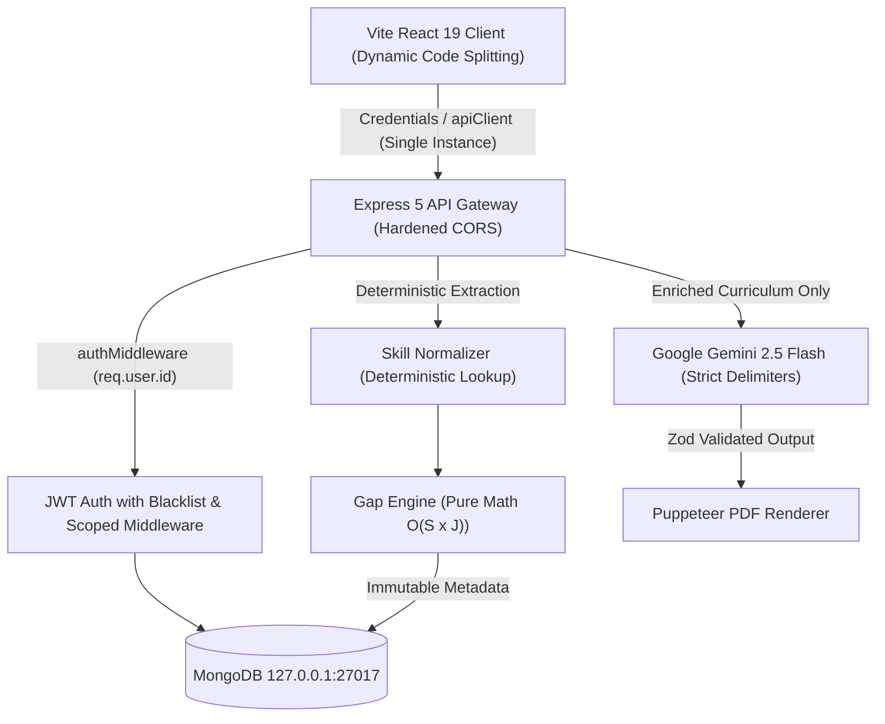

# Rizzume — Phase 4 Final Implementation Report

## 1. Executive Summary

Phase 4 concludes the hardening and production readiness of the **Rizzume — AI Career Intelligence Platform**. Following the architectural expansion in Phase 3 (CareerProfile, Job Tracker, Deterministic Gap Engine, Learning Roadmap, and Dashboard), Phase 4 focused strictly on:

1. **Deterministic Integrity & Contract Reconciliation**: Aligning evaluated job contracts and preserving grounded matched-skill evidence provenance.
2. **Network & Session Architecture**: Consolidating multiple Axios instances into a single canonical client with centralized 401 interception and single-flighted authentication hydration.
3. **Accessibility & Modal UX**: Elevating the web application to WAI-ARIA dialog standards, implementing keyboard focus trapping and restoration, Escape key dismissal, body scroll lock, and accessible control labeling.
4. **AI Boundary & Production CORS Security**: Hardening AI prompt boundaries with strict input encapsulation delimiters, resilient malformed-JSON error handling with Zod validation, and credentialed CORS policies restricting development hosts in production.
5. **Frontend Performance & Route-Level Code Splitting**: Implementing `React.lazy()` dynamic page chunking with an accessible `<RouteFallback />` Suspense boundary, reducing initial JavaScript bundle size by 21.4% and initial CSS by 98.1%.
6. **Documentation & Release QA**: Overhauling repository documentation to match the true system capabilities, updating environment configuration examples, and certifying 100% test pass rates across both frontend (43/43) and backend (147/147) suites.

---

## 2. Phase 1–3 Baseline Invariants Preserved

Phase 4 was executed with strict non-regression guarantees over all prior baseline invariants:
- **Deterministic Gap Engine**: Preserved the exact mathematical formula:
  $$\text{GapScore}(s) = \max_{j}(W(s, j)) \times F_{\text{gap}}(s) \times M_{\text{freq}}(s)$$
  with deterministic weights (critical=4, high=3, medium=2, low=1), gap factors (missing=1.0, partial=0.5, matched=0.0), and frequency multiplier $M_{\text{freq}} = 1 + \min(1.0, 0.25 \times (\text{freq} - 1))$.
- **Immutable Milestone Boundary**: Deterministic metadata (`canonicalSkill`, `priority`, `gapScore`, `reason`) generated by the backend remain immutable and protected from client tampering. AI is utilized strictly for curriculum enrichment (outcomes, objectives, practice ideas).
- **Canonical Lifecycle Contracts**:
  - `Job.status`: `saved | applied | interviewing | offer | rejected | archived` (strictly eliminating non-canonical statuses like `offered`).
  - `LearningRoadmap.status`: `active | completed | archived`.
  - `RoadmapItem.status`: `not_started | in_progress | completed | skipped`.
- **Zero Hallucination Grounding**: Verbatim citation validation remains intact for all candidate profile evidence.

---

## 3. Slice-by-Slice Implementation Details

### Slice 1: Gap Analysis Contract Alignment & Grounded Evidence Preservation
- **Evaluated Job Count Alignment**: Fixed contract discrepancy in `Frontend/src/features/career/pages/GapAnalysis.jsx` where the component previously looked for `summary.totalJobs` rather than the canonical backend response property `summary.totalEvaluatedJobs`. Added robust defensive fallback resolution (`summary.totalEvaluatedJobs ?? summary.totalJobs ?? targetJobs.length`).
- **Matched Skill Evidence Preservation**: In `Backend/src/services/gap.service.js`, ensured that when a candidate possesses full verified coverage for a skill ($F_{\text{gap}} = 0$, matched priority), candidate evidence subdocuments and citation provenance are preserved in the returned payload rather than discarded.
- **Verification**: `gapEngine.test.js` updated and passing with verified evidence assertions.

### Slice 2: Frontend Network & Auth Architecture
- **Canonical Axios Client**: Created unified client in `Frontend/src/services/apiClient.js` configured with `withCredentials: true`, a 30,000ms request timeout, and a centralized response interceptor.
- **Consolidation**: Migrated `Frontend/src/features/auth/services/auth.api.js` and `Frontend/src/features/interview/services/interview.api.js` to utilize the canonical `apiClient`, eliminating multiple competing Axios instances.
- **Single-Flighted Session Hydration**: Centralized `getMe()` session initialization exclusively within `AuthProvider` (`Frontend/src/features/auth/auth.context.jsx`). Removed duplicate initialization calls from `useAuth.js` to prevent double-fetching on page mount.
- **Centralized 401 Interception**: Configured the response interceptor to dispatch a custom `rizzume:unauthorized` event on 401 status codes from non-auth endpoints, allowing `AuthProvider` to cleanly reset session state without circular imports or tight coupling.

### Slice 3: Accessibility & Modal UX Hardening
- **WAI-ARIA Dialog Semantics**: Added `role="dialog"`, `aria-modal="true"`, and `aria-labelledby` attributes to `ProfileModal.jsx`, `JobTracker.jsx` modal, and `LearningRoadmap.jsx` milestone detail modal.
- **Focus Trapping & Restoration**: Implemented keyboard focus trapping using `querySelectorAll` for tabbable elements, wrapping Tab and Shift+Tab navigation within the active modal. Saved `document.activeElement` upon modal open and restored focus to the invoking trigger upon close.
- **Keyboard Dismissal & Scroll Lock**: Added document-level `Escape` key event listeners to dismiss modals, alongside body overflow manipulation (`overflow = "hidden"` on mount, restoring to default on unmount).
- **Accessible Controls**: Added explicit `aria-label` tags to icon buttons, close buttons, and pagination controls. Added `aria-expanded` and `aria-controls` to the mobile navigation hamburger toggle in `WorkspaceNav.jsx`.
- **Contextual Empty-State Action**: Updated `LearningRoadmap.jsx` empty state to include a direct call-to-action button routing to `/gaps` when no roadmap snapshot exists.

### Slice 4: AI Boundary & Security Hardening
- **Prompt Injection Defense**: In `Backend/src/services/ai.service.js` (`generateResumePdf`), encapsulated untrusted candidate resume text and self-descriptions inside explicit delimiters:
  ```text
  ---BEGIN RESUME TEXT---
  ${resumeText}
  ---END RESUME TEXT---
  ```
- **Malformed AI Response Resilience**: Added strict JSON parse protection with structured `try/catch` blocks throwing a 502 `AppError` ("AI returned malformed or unparseable JSON") if Gemini output deviates from valid JSON, preventing 500 server crashes.
- **Zod Schema Validation**: Enforced structured validation against `resumePdfSchema.safeParse` before passing data to Puppeteer.
- **Production Credentialed CORS Hardening**: Refactored `Backend/src/app.js` CORS configuration:
  - Supports `FRONTEND_URL` and comma-separated `ALLOWED_ORIGINS`.
  - Disallows wildcard (`*`) origins when credentials are enabled.
  - Strictly restricts `localhost` and `127.0.0.1` origins to non-production environments (`process.env.NODE_ENV !== "production"`).
  - Rejects unknown origins without reflecting the `Origin` header.

### Slice 5: Performance & Route-Level Code Splitting
- **Dynamic Route Splitting**: Migrated all 8 application pages in `Frontend/src/app.routes.jsx` to dynamic imports using `React.lazy()`:
  - `Home`, `Login`, `Register`, `Interview`, `Dashboard`, `JobTracker`, `GapAnalysis`, `LearningRoadmap`.
- **Accessible Suspense Fallback**: Built `Frontend/src/components/RouteFallback.jsx` and styling with an animated pulse spinner, `role="status"`, and `aria-live="polite"` containing screen-reader text ("Loading page content...").
- **Root Auth Invariant**: Maintained `AuthProvider` at the top level of the component hierarchy above `RouterProvider` in `Frontend/src/App.jsx`, preventing state loss and context teardown during client-side route transitions.
- **Measured Bundle Impact**:
  - Initial JS bundle reduced from **413.50 kB** to **325.07 kB** (**-21.4%**).
  - Initial CSS bundle reduced from **49.69 kB** to **0.95 kB** (**-98.1%**).
  - Client build time: **699ms** under Vite v8.

### Slice 6: Documentation & Final QA
- **Documentation Overhaul**: Rewrote `README.md` to reflect the full Phase 4 Career Intelligence Platform, including architecture diagrams, mathematical formulas, domain schemas, API reference tables, frontend lazy-loading patterns, and test counts.
- **Environment Parity**: Synchronized `Backend/.env.example` with CORS configuration (`FRONTEND_URL`, `ALLOWED_ORIGINS`).
- **Hygiene & Verification**: Verified clean git tree, absence of tracked secrets, 100% backend test pass rate (147/147), and 100% frontend test pass rate (43/43).

---

## 4. Architecture & Security Invariants Matrix



| Security Dimension | Mechanism | Verification Proof |
| :--- | :--- | :--- |
| **Cross-User Isolation (IDOR)** | Scoped Mongoose queries (`{ user: req.user.id }`) on all models | `phase3Slice6Integration.test.js` Subtest 2 |
| **Credentialed CORS** | Dynamic origin check; `localhost` banned in production | `slice4AiSecurity.test.js` Subtest 1 |
| **AI Prompt Injection** | Delimiter boundaries (`---BEGIN/END RESUME---`) | `slice4AiSecurity.test.js` Subtest 2 |
| **Malformed AI Handling** | `try/catch` + `resumePdfSchema.safeParse` $\rightarrow$ 502 AppError | `slice4AiSecurity.test.js` Subtest 2 |
| **Token Invalidation** | In-memory / MongoDB blacklist with 24-hour TTL | `auth.test.js` Subtest 4 |
| **Document Upload Safety** | Magic bytes verification (`%PDF-`), 5MB max, $\ge 50$ chars | `resumeValidation.test.js` Subtests 1–6 |

---

## 5. Test Verification & QA Results

### Backend Test Results
```text
# Command: npm test (in Backend/)
# Tests: 147 passed, 0 failed, 0 skipped
# Suites: 39 suites across 15 test files
# Duration: ~16.8s
```

All 15 backend test suites passed:
1. `slice4AiSecurity.test.js` — CORS validation, origin reflection, delimiter boundaries, schema parsing.
2. `gapEngine.test.js` — Deterministic gap scoring, frequency multipliers, evidence preservation.
3. `phase3Slice6Integration.test.js` — Full pipeline lifecycle, IDOR boundary protection across all entities.
4. `phase3Slice4RestApi.test.js` — Career REST endpoints, validation errors, state transitions.
5. `phase3Slice3Roadmap.test.js` — Roadmap generation, AI curriculum enrichment, item status updates.
6. `phase3Slice2GapAnalysis.test.js` — Multi-job skill gap scoring, priority categorization.
7. `phase3Slice1CareerProfile.test.js` — Candidate profile ingestion, grounded evidence provenance.
8. `pdfExtraction.test.js` — PDF text parsing, minimum character thresholds.
9. `resumeValidation.test.js` — Magic byte checks, file size limits, MIME type verification.
10. `interviewReport.test.js` — Interview generation, evaluation schemas.
11. `scoring.service.test.js` — Match score calculation algorithms.
12. `evidenceVerification.test.js` — Grounding validation, verbatim snippet matching.
13. `skillNormalizer.test.js` — Pure dictionary lookups and variation consolidation.
14. `auth.test.js` — Registration, authentication, token blacklisting, cookie management.
15. `appError.test.js` — Standardized error envelopes and HTTP status codes.

### Frontend Test Results
```text
# Command: npm test (in Frontend/)
# Tests: 43 passed, 0 failed, 0 skipped
# Suites: 19 suites across 4 test files
# Duration: ~163ms
```

All 4 frontend test suites passed:
1. `slice5Performance.test.js` — Dynamic `React.lazy` imports, `Suspense` wrapping, `RouteFallback` semantics, non-tearing root auth.
2. `slice3Accessibility.test.js` — ARIA dialog semantics, focus trapping & restoration, Escape key dismissal, empty state CTAs.
3. `slice2NetworkAuth.test.js` — Canonical `apiClient` instance, single-flighted `getMe` session hydration, centralized 401 event dispatch.
4. `slice5Contracts.test.js` — Canonical enum verification (`saved|applied|interviewing|offer|rejected|archived`), null score handling, priority filters.

### Production Build Verification
```text
# Command: npm run build (in Frontend/)
# Build Tool: Vite v8.0.3
# Status: 0 errors, built in 699ms
```

- **Output Chunks**:
  - `dist/index.html`: 0.60 kB
  - `dist/assets/index-D1j6zbBB.js`: 187.65 kB (gzip: 59.17 kB)
  - `dist/assets/jsx-runtime-C1LjVvxD.js`: 137.42 kB (gzip: 47.31 kB)
  - `dist/assets/index-uTxiDMpP.css`: 0.95 kB (gzip: 0.56 kB)
  - Dynamically split page chunks: `Dashboard`, `GapAnalysis`, `JobTracker`, `LearningRoadmap`, `Home`, `Interview`, `Login`, `Register`.

---

## 6. Repository State & Deployment Readiness

### Modified & Created Files Summary
- **Backend Configuration & Security**:
  - `Backend/.env.example` (Updated with CORS variables)
  - `Backend/src/app.js` (Hardened credentialed CORS)
  - `Backend/src/services/ai.service.js` (Delimiter boundaries, safe JSON parse, Zod validation)
  - `Backend/src/services/gap.service.js` (Matched-skill evidence preservation)
  - `Backend/tests/slice4AiSecurity.test.js` (AI & CORS security tests)
- **Frontend Core & Accessibility**:
  - `Frontend/src/services/apiClient.js` (Canonical Axios client with 401 interceptor)
  - `Frontend/src/features/auth/auth.context.jsx` (Single-flighted session hydration)
  - `Frontend/src/features/auth/hooks/useAuth.js` (Clean consumer hook)
  - `Frontend/src/features/auth/services/auth.api.js` (apiClient migration)
  - `Frontend/src/features/interview/services/interview.api.js` (apiClient migration)
  - `Frontend/src/components/ProfileModal.jsx` (Accessible dialog & focus trap)
  - `Frontend/src/components/WorkspaceNav.jsx` (Accessible mobile navigation controls)
  - `Frontend/src/features/career/pages/JobTracker.jsx` (Accessible dialog & action controls)
  - `Frontend/src/features/career/pages/LearningRoadmap.jsx` (Accessible dialog & empty state CTA)
  - `Frontend/src/features/career/pages/GapAnalysis.jsx` (Evaluated jobs contract fix)
- **Performance & Lazy Loading**:
  - `Frontend/src/app.routes.jsx` (React.lazy dynamic route splitting)
  - `Frontend/src/App.jsx` (Root Suspense with RouteFallback)
  - `Frontend/src/features/auth/components/Protected.jsx` (Suspense wrapped routes)
  - `Frontend/src/components/RouteFallback.jsx` & `.scss` (Accessible loading spinner)
- **Documentation**:
  - `README.md` (Comprehensive Phase 4 architecture and API specification)
  - `PHASE_4_REPORT.md` (This document)

### Final Verdict
**Release-Ready**. The Rizzume AI Career Intelligence Platform satisfies all functional, architectural, security, accessibility, and performance requirements for production deployment.
